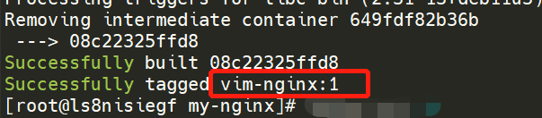
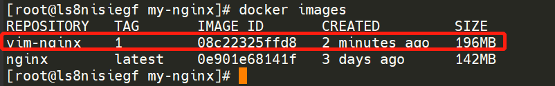
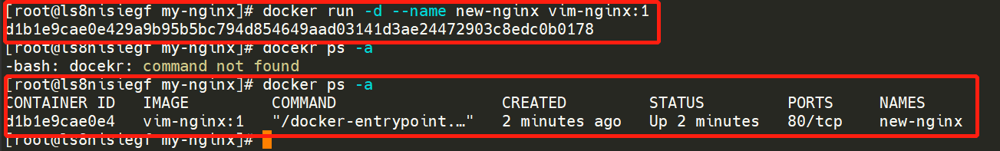
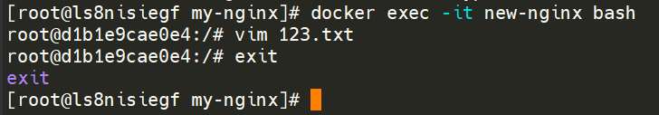
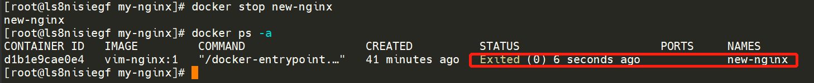
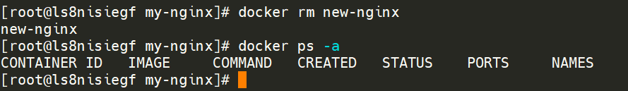
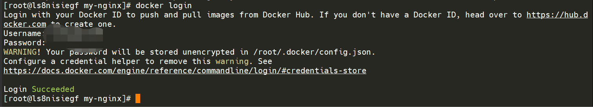
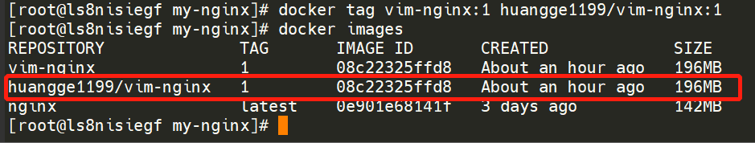

# 1、编写Dockerfile

Dockerfile

```
FROM nginx
RUN apt update && apt install -y vim
```

# 2、构建镜像

执行命令：

```shell
docker build -t vim-nginx:1 .
```

> 注：要在Dockerfile所在目录下执行

这步时间较长，多等等，出现下面红框表示安装成功



完成后，执行命令确认镜像生成：

```shell
docker images
```



# 3、测试镜像

启动容器：

```shell
docker run -d --name new-nginx vim-nginx:1
docker ps -a
```

下面红框内是执行过程，中间的部分我命令敲错了，忽略掉



进入容器使用vim命令：

```shell
docker exec -it new-nginx bash
vim 123.txt
exit
```



停止容器：

```shell
docker stop new-nginx
docker ps -a
```



删除容器：

```shell
docker rm new-nginx
docker ps -a
```



# 4、docker登录

执行命令：

```shell
docker login
```

然后输入用户名和密码

> 注：用户名不是登录的邮箱



# 5、镜像修改

tag命令修改为规范的镜像：

```shell
docker tag vim-nginx:1 huangge1199/vim-nginx:1
docker images
```



# 6、推送镜像

```shell
docker push huangge1199/vim-nginx:1
```


# 7、删除本地镜像

```shell
docker rmi huangge1199/vim-nginx:1
```


# 8、拉取镜像

```shell
docker pull 
```


# 9、重复3的步骤测试镜像

> 注意步骤3和现在的镜像名可能不同，记得替换
