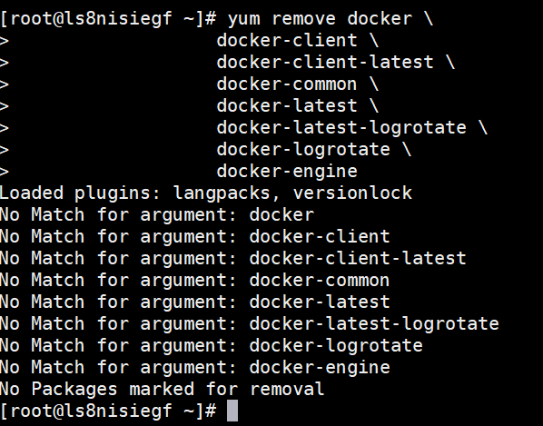
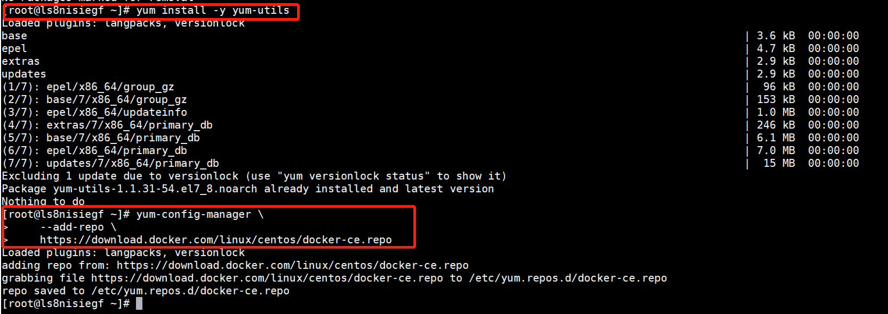
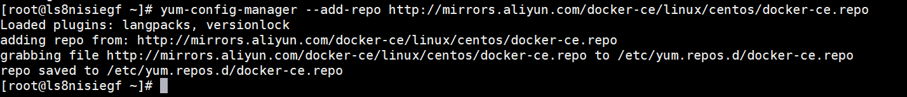
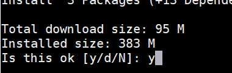
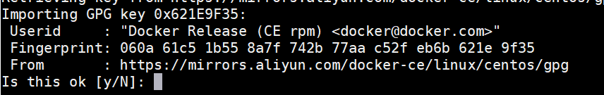
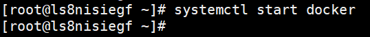
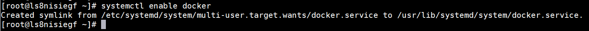

安装docker

这部分基本就是按照docker官网的来，[centos安装docker文档](https://docs.docker.com/engine/install/centos/)

# 1、卸载旧版本docker

```sh
yum remove docker \
                  docker-client \
                  docker-client-latest \
                  docker-common \
                  docker-latest \
                  docker-latest-logrotate \
                  docker-logrotate \
                  docker-engine
```



# 2、设置docker软件源

下面官网软件源和阿里软件源二选一，个人建议用阿里的，国内的速度快

官网软件源 ：速度慢，可以考虑阿里的

```shell
yum install -y yum-utils
yum-config-manager \
    --add-repo \
    https://download.docker.com/linux/centos/docker-ce.repo
```



阿里软件源：



# 3、安装docker

```shell
yum install docker-ce docker-ce-cli containerd.io
```

命令输入后，中途出现下面的内容，输入`y`，然后按回车确认



中途出现下面的内容，输入`y`，然后按回车确认



# 4、更改docker仓库地址，用Docker中国区官方替换掉，要不之后拉取镜像速度太慢了

```shell
vi /etc/docker/daemon.json
```

daemon.json内容：

```json
{
 "registry-mirrors": ["https://registry.docker-cn.com"]
}
```

# 5、启动docker

```shell
systemctl start docker
```



# 6、设置开机启动docker

```shell
systemctl enable docker
```



# 7、验证

通过查询docker版本确认docker是否正常启动

```shell
docker -v
```

执行命令后正常显示docker版本则为安装启动成功
