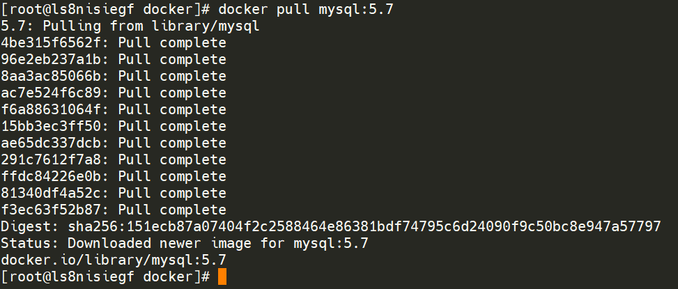
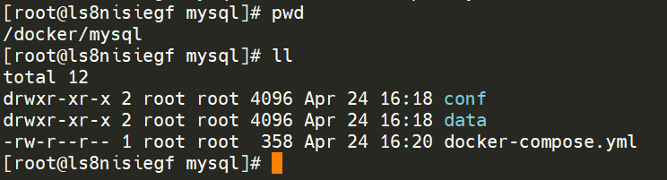
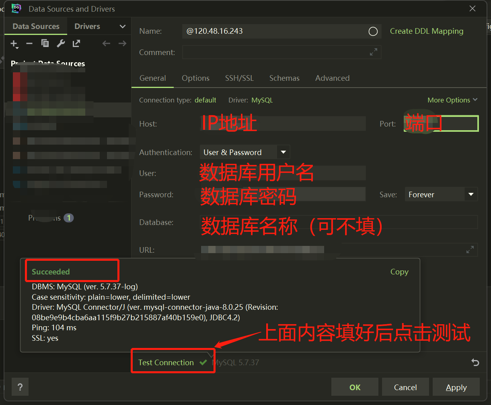

docker中安装MySQL

本教程以MySQL5.7版本为例编写，如需其他版本，可自行前往docker hub网站查找对应的镜像，安装可能回和本教程有一定出入，清自行处理。
如遇问题也可以在评论中回复，本人会尽快给与回复

# 1、拉取镜像

```shell
docker pull mysql:5.7
```



# 2、编写docker-compose.yml文件

内容如下：

```yaml
version: '3'
services:
    mysql:
        container_name: mysql
        image: mysql:5.7
        environment:
            - MYSQL_ROOT_PASSWORD=此处为root密码自行设置
            - TZ=Asia/Shanghai
        volumes: 
            - ./conf:/etc/mysql
            - ./data:/var/lib/mysql
            - ./init:/docker-entrypoint-initdb.d/
        ports: 
            - 50010:3306
        restart: always
```

# 3、创建目录文件

根据docker-compose.yml文件创建对应目录文件



# 4、编写MySQL的配置文件

在conf目录下创建my.cnf文件，文件内容如下：

```
[mysqld]
lower_case_table_names=1
innodb_force_recovery = 0

log-bin=/var/lib/mysql/mysql-bin
binlog-format=ROW
server_id=1
```

# 5、启动MySQL容器

```shell
docker-compose up -d
```


# 6、远程连接验证结果


