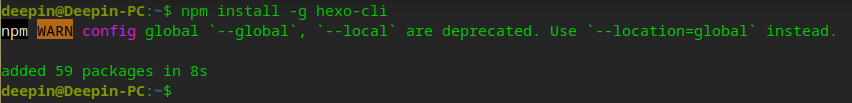
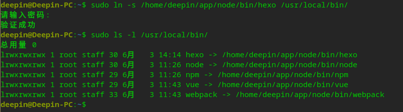
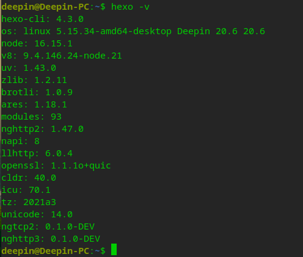

# 1、前置条件

安装好nodejs

参考：[deepin下安装nodejs](http://192.168.0.198:5080/post/inNodejsByOsDeepin/)

# 2、全局安装Hexo

执行命令：

```shell
npm install -g hexo-cli
```



# 3、创建软链接

```shell
# 创建hexo软链接
sudo ln -s /home/deepin/app/node/bin/hexo /usr/local/bin/
# 查看软链接列表
sudo ls -l /usr/local/bin/
```



# 4、查看Hexo版本

```shell
hexo -v
```


