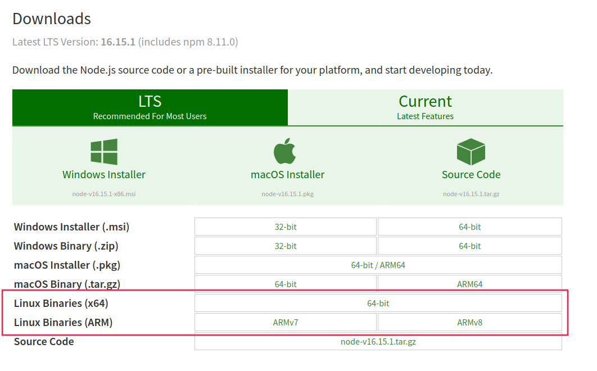
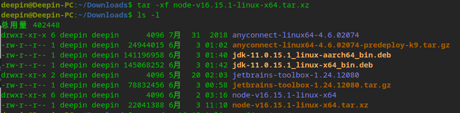
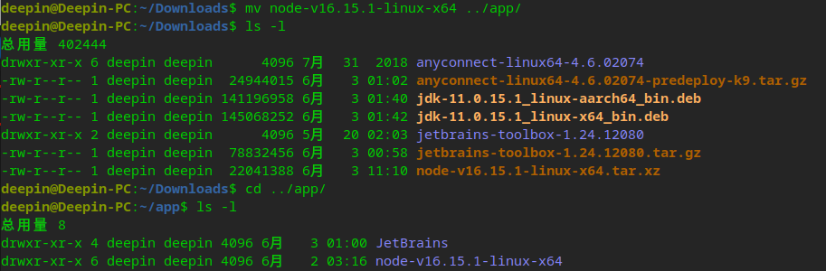
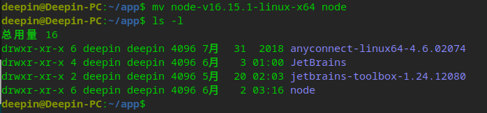
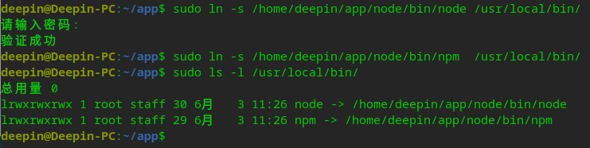
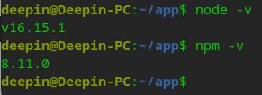
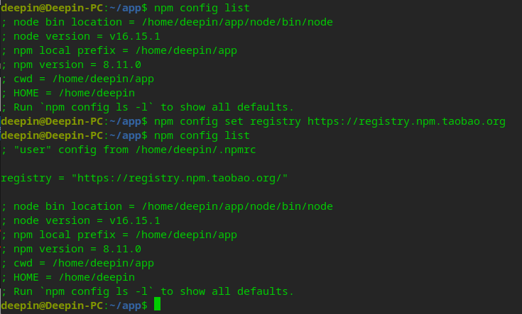

# 1、下载安装包

[官网地址](https://nodejs.org/en/download/)



> 注意版本

# 2、解压安装包

执行命令：

```shell
# 解压命令
tar -xf node-v16.15.1-linux-x64.tar.xz
# 查看列表
ls -l
```



# 3、移动文件

这步是为了方便找到自己安装的软件，可做可不做

我这边是统一移动到用户的app目录下

```shell
# 移动文件
mv node-v16.15.1-linux-x64 ../app/
# 查看列表
ls -l
# 切换目录
cd ../app/
# 查看列表
ls -l
# 更改名称（目录名过长）
mv node-v16.15.1-linux-x64 node
# 查看列表
ls -l
```





# 4、创建软链接

```shell
# 创建node软链接
sudo ln -s /home/deepin/app/node/bin/node /usr/local/bin/
# 创建npm软链接
sudo ln -s /home/deepin/app/node/bin/npm  /usr/local/bin/
# 确认软链接建立好了
sudo ls -l /usr/local/bin/
```

> 此处涉及到权限问题，因此命令前要加`sudo`



# 5、确认node和npm版本

```shell
node -v
npm -v
```



# 6、设置镜像

设置国内淘宝的镜像，提高npm的下载速度

```shell
# 查看npm配置列表
npm config list
# 执行如下命令设置成国内的镜像
npm config set registry https://registry.npm.taobao.org
# 查看npm配置列表
npm config list
```


