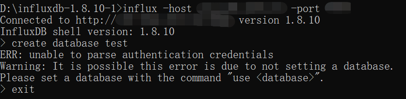

# 1、获取安装包

```sh
wget https://dl.influxdata.com/influxdb/releases/influxdb-1.8.10.x86_64.rpm
```


# 2、安装

```sh
yum localinstall influxdb-1.8.10.x86_64.rpm
```

# 3、配置

```shell
vim /etc/influxdb/influxdb.conf
```

用户名密码（非必须）


开启influx功能


# 4、启动服务

```shell
systemctl start influxdb
```

# 5、启动

```shell
influx
```

在客户端工具窗口中执行以下语句设置用户名和密码（非必须）：

```shell
# 创建管理员权限的用户
CREATE USER root WITH PASSWORD 'root' WITH ALL PRIVILEGES
```

# 6、验证

用其他机器远程连接：

```shell
influx -host ip地址 -port 端口号
```



这里创建数据库时报错，是因为我这边配置了用户名和密码，需要连接时带上用户名和密码才行

```shell
iinflux -host ip地址 -port 端口号 -username 用户名 -password 密码
```


