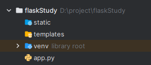

本篇文章是[Python Flask 建站框架入门课程_编程实战微课_w3cschool](https://www.w3cschool.cn/minicourse/play/pyflask)微课的学习笔记，根据课程整理而来，本人使用版本如下：

| Python | 3.10.0 |
| ------ | ------ |
| Flask  | 2.2.2  |

# 简介

- Flask是一个轻量级的可定制的web框架

- Flask 可以很好地结合MVC模式进行开发

- Flask还有很强的很强的扩展性和兼容性

# 核心函数库

Flask主要包括Werkzeug和Jinja2两个核心函数库，它们分别负责业务处理和安全方面的功能，这些基础函数为web项目开发过程提供了丰富的基础组件。

## Werkzeug

Werkzeug库十分强大，功能比较完善，支持URL路由请求集成，一次可以响应多个用户的访问请求；

支持Cookie和会话管理，通过身份缓存数据建立长久连接关系，并提高用户访问速度；支持交互式Javascript调试，提高用户体验；

可以处理HTTP基本事务，快速响应客户端推送过来的访问请求。

## Jinja2

Jinja2库支持自动HTML转移功能，能够很好控制外部黑客的脚本攻击；

系统运行速度很快，页面加载过程会将源码进行编译形成python字节码，从而实现模板的高效运行；

模板继承机制可以对模板内容进行修改和维护，为不同需求的用户提供相应的模板。

# 安装

通过pip安装即可

```batch
pip install Flask
# pip3
pip3 install Flask
```

# 目录结构

## 新项目创建后的结构



static文件夹：存放静态文件，比如css、js、图片等

templates文件夹：模板文件目录

app.py：应用启动程序

# 获取URL参数

## 列出所有URL参数

`request.args.__str__()`

```python
from flask import Flask, request

app = Flask(__name__)


@app.route('/')
def hello_world():  # put application's code here
    return request.args.__str__()


if __name__ == '__main__':
    app.run()

```

在浏览器中访问`http://127.0.0.1:5000/?name=Loen&age&app=ios&app=android`，将显示：

```
ImmutableMultiDict([('name', 'Loen'), ('age', ''), ('app', 'ios'), ('app', 'android')])
```

## 列出浏览器传给我们的Flask服务的数据

```python
from flask import Flask, request

app = Flask(__name__)


@app.route('/')
def hello_world():  # put application's code here

    # 列出访问地址
    print(request.path)

    # 列出访问地址及参数
    print(request.full_path)

    return request.args.__str__()


if __name__ == '__main__':
    app.run()

```

在浏览器中访问`http://127.0.0.1:5000/?name=Loen&age&app=ios&app=android`，控制台中显示

```
/
/?name=Loen&age&app=ios&app=android
```

## 获取指定的参数值

```python
from flask import Flask, request

app = Flask(__name__)


@app.route('/')
def hello_world():  # put application's code here

    return request.args.get('name')


if __name__ == '__main__':
    app.run()

```

在浏览器中访问`http://127.0.0.1:5000/?name=Loen&age&app=ios&app=android`，将显示：

```
Loen
```

## 处理多值

```pythoon
from flask import Flask, request

app = Flask(__name__)


@app.route('/')
def hello_world():  # put application's code here
    r = request.args.getlist('app')  # 返回一个list
    return r


if __name__ == '__main__':
    app.run()

```

在浏览器中访问`http://127.0.0.1:5000/?name=Loen&age&app=ios&app=android`，将显示：

```
[
  "ios",
  "android"
]
```

# 获取POST方法传送的数据

作为一种HTTP请求方法，POST用于向指定的资源提交要被处理的数据。

我们在某些时候不适合将数据放到URL参数中，密或者数据太多，浏览器不一定支持太长长度的URL。这时，一般使用POST方法。

本文章使用python的requests库模拟浏览器。

安装命令：

```batch
pip install requests
```

## 看POST数据内容

app.py代码如下：

```python
from flask import Flask, request

app = Flask(__name__)


@app.route('/register', methods=['POST'])
def register():
    print(request.headers)
    print(request.stream.read())
    return 'welcome'


if __name__ == '__main__':
    app.run()

```

register.py代码如下：

```python
import requests

if __name__ == '__main__':
    user_info = {'name': 'Loen', 'password': 'loveyou'}
    r = requests.post("http://127.0.0.1:5000/register", data=user_info)
    print(r.text)

```

运行`app.py`，然后运行`register.py`。

`register.py`将输出：

```
welcome
```

`app.py`将输出：

```
Host: 127.0.0.1:5000
User-Agent: python-requests/2.28.2
Accept-Encoding: gzip, deflate
Accept: */*
Connection: keep-alive
Content-Length: 26
Content-Type: application/x-www-form-urlencoded


b'name=Loen&password=loveyou'
127.0.0.1 - - [14/Feb/2023 21:12:17] "POST /register HTTP/1.1" 200 -
```

## 解析POST数据

app.py代码如下：

```python
from flask import Flask, request

app = Flask(__name__)


@app.route('/register', methods=['POST'])
def register():
    # print(request.stream.read()) # 不要用，否则下面的form取不到数据
    print(request.form)
    print(request.form['name'])
    print(request.form.get('name'))
    print(request.form.getlist('name'))
    print(request.form.get('nickname', default='little apple'))
    return 'welcome'


if __name__ == '__main__':
    app.run(port=5000, debug=True)

```

register.py代码不变，运行`app.py`，然后运行`register.py`。

`register.py`将输出：

```
welcome
```

`app.py`将输出：

```
ImmutableMultiDict([('name', 'Loen'), ('password', 'loveyou')])
Loen
Loen
['Loen']
little apple
```

request.form会自动解析数据。

request.form['name']和request.form.get('name')都可以获取name对应的值。

request.form.get()可以为参数default指定值以作为默认值。

## 获取POST中的列表数据

app.py代码如下：

```python
from flask import Flask, request

app = Flask(__name__)


@app.route('/register', methods=['POST'])
def register():
    # print(request.stream.read()) # 不要用，否则下面的form取不到数据
    print(request.form.getlist('name'))
    return 'welcome'


if __name__ == '__main__':
    app.run(port=5000, debug=True)

```

register.py代码如下：

```python
import requests

if __name__ == '__main__':
    user_info = {'name': ['Loen', 'Alan'], 'password': 'loveyou'}
    r = requests.post("http://127.0.0.1:5000/register", data=user_info)
    print(r.text)

```

运行`app.py`，然后运行`register.py`。

`register.py`将输出：

```
welcome
```

`app.py`将输出：

```
['Loen', 'Alan']
```

# 处理和响应JSON数据

## 处理JSON数据

如果POST的数据是JSON格式，request.json会自动将json数据转换成Python类型（字典或者列表）。

app.py代码如下：

```python
from flask import Flask, request

app = Flask(__name__)


@app.route('/add', methods=['POST'])
def add():
    print(type(request.json))
    print(request.json)
    result = request.json['n1'] + request.json['n2']
    return str(result)


if __name__ == '__main__':
    app.run(port=5000, debug=True)

```

register.py代码如下：

```python
import requests

if __name__ == '__main__':
    json_data = {'n1': 5, 'n2': 3}
    r = requests.post("http://127.0.0.1:5000/add", json=json_data)
    print(r.text)

```

运行`app.py`，然后运行`register.py`。

`register.py`将输出：

```
8
```

`app.py`将输出：

```
<class 'dict'>
{'n1': 5, 'n2': 3}
```

## 响应JSON数据（Response）

app.py代码如下：

```python
import json

from flask import Flask, request, Response

app = Flask(__name__)


@app.route('/add', methods=['POST'])
def add():
    result = {'sum': request.json['n1'] + request.json['n2']}
    return Response(json.dumps(result), mimetype='application/json')


if __name__ == '__main__':
    app.run(port=5000, debug=True)

```

register.py代码如下：

```python
import requests

if __name__ == '__main__':
    json_data = {'n1': 5, 'n2': 3}
    r = requests.post("http://127.0.0.1:5000/add", json=json_data)
    print(r.headers)
    print(r.text)

```

运行`app.py`，然后运行`register.py`。

`register.py`将输出：

```
/home/huangge1199/PycharmProjects/flaskProject/venv/bin/python /home/huangge1199/PycharmProjects/flaskProject/register.py 
{'Server': 'Werkzeug/2.2.2 Python/3.7.3', 'Date': 'Tue, 14 Feb 2023 13:37:49 GMT', 'Content-Type': 'application/json', 'Content-Length': '10', 'Connection': 'close'}
{"sum": 8}
```

## 响应JSON数据（jsonify）

app.py中app()返回时使用下面的内容，效果同之前一样

```python
return jsonify(result)
```

