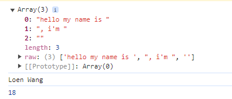

# Typescript 简介

TypeScript是用于应用程序规模开发的JavaScript。

TypeScript是强类型，面向对象的编译语言。它是由微软的Anders Hejlsberg（C＃的设计者）设计的。

TypeScript既是一种语言又是一组工具。TypeScript是JavaScript的一个超集。换句话说，TypeScript是JavaScript加上一些额外的功能。

TypeScript 扩展了 JavaScript 的语法，所以任何现有的 JavaScript 程序可以不加改变的在 TypeScript 下工作。TypeScript 是为大型应用之开发而设计，而编译时它产生 JavaScript 以确保兼容性。

TypeScript 可以编译出纯净、 简洁的 JavaScript 代码，并且可以运行在任何浏览器上、Node.js 环境中和任何支持 ECMAScript 3（或更高版本）的 JavaScript 引擎中。

# TypeScript 的优势

TypeScript相对于纯粹的JavaScript具有许多优势，特别是在开发大型应用程序时。以下是一些TypeScript的优势：

## 静态类型系统

TypeScript引入了静态类型系统，允许开发者在声明变量、函数参数、返回值等时指定类型。这种静态类型检查可以帮助捕获常见的编程错误，例如类型不匹配、未定义的属性或方法等，提供更好的代码质量和可靠性。

## 更好的代码智能感知

因为TypeScript了解代码中的类型信息，因此编辑器可以提供更准确和强大的代码智能感知和自动补全功能。这可以显著提高开发效率，并减少常见的编码错误。

## 更易于重构和维护

静态类型和面向对象特性使得代码更模块化、更结构化，从而更易于重构和维护。IDE可以更好地支持重构操作，并能够更好地理解代码的结构和依赖关系。

## 更丰富的面向对象特性

TypeScript支持类、接口、继承、多态等面向对象编程的特性，使得代码组织更清晰、更易于理解。这对于构建大型应用程序非常有用。

## 更好的工具支持：

TypeScript配合现代的集成开发环境（如VS Code、WebStorm等），可以提供强大的代码导航、重构、调试和代码分析工具。此外，TypeScript还能够与许多流行的前端框架（如Angular、React等）良好集成。

## 增强的语言功能：

TypeScript不仅仅是JavaScript的超集，它还引入了一些新的语言功能，如箭头函数、可选参数、默认参数、模板字符串等，使得代码更简洁和易读。

## 更好的生态系统：

TypeScript拥有庞大的社区支持，许多常用的JavaScript库和框架都提供了类型定义文件，可以轻松地与TypeScript集成。这使得使用第三方库时具有更好的类型安全性和开发体验。

# 基础类型

TypeScript支持与JavaScript几乎相同的数据类型 数字，字符串，结构体，布尔值等，此外还提供了实用的枚举类型方便我们使用。

## 布尔值

最基本的数据类型就是简单的 true/false 值，在 JavaScript 和 TypeScript 里叫做 boolean（其它语言中也一样）。 我们来定义一个布尔类型的变量:

```ts
let isDone: boolean = false;
```

在TypeScript中, 在参数名称后面使用冒号:来指定参数的类型

```ts
let 变量名: 数据类型
```

## 数字

和 JavaScript 一样，TypeScript 里的所有数字都是浮点数。 这些浮点数的类型是 number。 除了支持十进制和十六进制字面量，TypeScript 还支持 ECMAScript 2015 中引入的二进制和八进制字面量。

```ts
let decLiteral: number = 6;
let hexLiteral: number = 0xf00d;
let binaryLiteral: number = 0b1010;
let octalLiteral: number = 0o744;
```

## 字符串

### 字符串新特性

JavaScript 程序的另一项基本操作是处理网页或服务器端的文本数据。 像其它语言里一样，我们使用 string 表示文本数据类型。 和 JavaScript 一样，可以使用双引号 "或单引号'表示字符串。

```ts
let name: string = "bob";
name = "loen";
```

以上字符串不支持换行.

### 多行字符串

在Typescript中你可以使用反引号 ` 表示多行字符串.

```ts
let hello: string = `Welcome to 
W3cschool`;
```

### 内嵌表达式

你还可以使用模版字符串，也就是在反引号中使用 ${ expr }这种形式嵌入表达式

```ts
let name: string = `Loen`;
let age: number = 37;
let sentence: string = `Hello, my name is ${ name }.


I'll be ${ age + 1 } years old next month.`;
```


这与下面定义sentence的方式效果相同：

```ts
let sentence: string = "Hello, my name is " + name + ".\n\n" +
    "I'll be " + (age + 1) + " years old next month.";
```

> 我们可以看到Typescript定义的字符串更加清晰简单.

### 自动拆分字符串

我们可以用字符串模板去调用一个方法

```ts
function userinfo(params,name,age){
    console.log(params);
    console.log(name);
    console.log(age);
}


let myname = "Loen Wang";
let getAge = function(){
    return 18;
}
// 调用
userinfo`hello my name is ${myname}, i'm ${getAge()}`
```

结果：


## 数组

TypeScript 有两种方式可以定义数组。

第一种, 是在元素类型后面接上 `[]`，表示由此类型元素组成的一个数组：

```ts
let list: number[] = [1, 2, 3];
```

第二种方式是使用数组泛型，Array<元素类型>：

```ts
let list: Array<number> = [1, 2, 3];
```

## 元组 Tuple

元组类型允许表示一个已知元素数量和类型的数组，各元素的类型不必相同。 比如，你可以定义一对值分别为 `string` 和 `number` 类型的元组。

```ts
// 声明一个元组类型
let x: [string, number];
// 初始化元组
x = ['hello', 10]; 
x = [10, 'hello']; // 这里会报错,类型错误
```

## 枚举

`enum` 类型是对 JavaScript 标准数据类型的一个补充。 像 C# 等其它语言一样，使用枚举类型可以为一组数值赋予友好的名字。

```ts
enum Color {Red, Green, Blue}
let c: Color = Color.Green;
```

默认情况下，**从0开始为元素编号**。 你也可以手动的指定成员的数值。 例如，我们将上面的例子改成从 1开始编号：

```ts
enum Color {Red = 1, Green, Blue}
let c: Color = Color.Green;
```

或者，全部都采用手动赋值：

```ts
enum Color {Red = 1, Green = 2, Blue = 4}
let c: Color = Color.Green;
```

枚举类型提供的一个便利是你可以由枚举的值得到它的名字。 例如，我们知道数值为2，但是不确定它映射到Color里的哪个名字，我们可以查找相应的名字：

```ts
enum Color {Red = 1, Green, Blue}
let colorName: string = Color[2];


alert(colorName);  // 显示'Green'因为上面代码里它的值是2
```

## Any

如果不希望类型检查器对值进行检查,直接通过编译阶段的检查。 那么我们可以使用 `any`类型来标记这些变量：

```ts
let notSure: any = 4;
notSure = "这是一个字符串";
notSure = false; // 现在我们又可以将其改成布尔类型
```

在对现有代码进行改写的时候，`any`类型是十分有用的，它允许你在编译时可选择地包含或移除类型检查。 你可能认为 Object有相似的作用，就像它在其它语言中那样。 但是 Object类型的变量只是允许你给它赋任意值 - 但是却不能够在它上面调用任意的方法，即便它真的有这些方法：

```ts
let notSure: any = 4;
notSure.ifItExists();// 存在这个方法
notSure.toFixed(); // 存在这个方法


let prettySure: Object = 4;
prettySure.toFixed(); // 错误：对象类型上不存在 toFixed 属性
```

当你只知道一部分数据的类型时，`any`类型也是有用的。 比如，你有一个数组，它包含了不同的类型的数据：

```ts
let list: any[] = [1, true, "free"];


list[1] = 100;
```

## Void

某种程度上来说，`void`类型像是与`any`类型相反，它表示没有任何类型。 当一个函数没有返回值时，你通常会见到其返回值类型是 `void`：

```ts
function warnUser(): void {
    alert("This is my warning message");
}
```

声明一个`void`类型的变量没有什么大用，因为你只能为它赋予`undefined`和`null`：

```ts
let unusable: void = undefined;
```

## Null 和 Undefined

TypeScript 里，`undefined` 和 `null` 两者各自有自己的类型分别叫做 `undefined` 和 `null`。 和 `void` 相似，它们的本身的类型用处不是很大：

```ts
// 我们无法给这些变量赋值
let u: undefined = undefined;
let n: null = null;
```

默认情况下 **null 和 undefined 是所有类型的子类型**。

就是说你可以把 null 和 undefined 赋值给 number 类型的变量。

然而，当你编译时指定了 --strictNullChecks 标记， null 和 undefined 只能赋值给 void 和它们自己。

> 注意：我们鼓励尽可能地使用`--strictNullChecks`，但在本教程里我们假设这个标记是关闭的。

## Never

`never` 类型表示的是那些永不存在的值的类型。

例如， never 类型是那些总是会抛出异常或根本就不会有返回值的函数表达式或箭头函数表达式的返回值类型；

`never` 类型是任何类型的子类型，也可以赋值给任何类型； 然而，没有类型是 never 的子类型或可以赋值给 never 类型（除了 never 本身之外）。 即使 any 也不可以赋值给 never 。

下面是一些返回 never 类型的函数：

```ts
// 返回never的函数必须存在无法达到的终点
function error(message: string): never {
    throw new Error(message);
}


// 推断的返回值类型为never
function fail() {
    return error("Something failed");
}


// 返回never的函数必须存在无法达到的终点
function infiniteLoop(): never {
    while (true) {
    }
}
```

> 箭头表达式将再后面的课程中学习到。

## 类型断言

通过类型断言这种方式可以告诉编译器，“相信我，我知道自己在干什么”。 类型断言好比其它语言里的类型转换，但是不进行特殊的数据检查和解构。 它没有运行时的影响，只是在编译阶段起作用。

TypeScript 会假设你，程序员，已经进行了必须的检查。

类型断言有两种形式。 其一是`尖括号`语法：

```ts
let someValue: any = "this is a string";


let strLength: number = (<string>someValue).length;
```

另一个为`as`语法：

```ts
let someValue: any = "this is a string";


let strLength: number = (someValue as string).length;
```

两种形式是等价的。 至于使用哪个大多数情况下是凭个人喜好；

然而，当你在 TypeScript 里使用 `JSX` 时，只有 `as`语法断言是被允许的。

# 符号介绍

自ECMAScript 2015起，symbol成为了一种新的原生类型，就像number和string一样。

symbol类型的值是通过Symbol构造函数创建的。

```ts
let sym1 = Symbol();
let sym2 = Symbol("key"); // 可选的字符串key
```

Symbols是不可改变且唯一的。

```ts
let sym2 = Symbol("key");
let sym3 = Symbol("key");


sym2 === sym3; // false
```

symbols是唯一的像字符串一样，symbols也可以被用做对象属性的键。

```ts
let sym = Symbol();
let obj = {
    [sym]: "value"
};


console.log(obj[sym]); // "value"
```

Symbols也可以与计算出的属性名声明相结合来声明对象的属性和类成员。

```ts
const getClassNameSymbol = Symbol();


class C {
    [getClassNameSymbol](){
       return "C";
    }
}


let c = new C();
let className = c[getClassNameSymbol](); // "C"
```

# 变量声明

## let和const

`let`和`const`是JavaScript里相对较新的变量声明方式。 像我们之前提到过的， let在很多方面与`var`是相似的，但是可以帮助大家避免在JavaScript里常见一些问题。 `const`只能一次赋值, 再次赋值会报错。

- let可以多次写入

- const只允许一次写入

因为 TypeScript 是 JavaScript 的超集，所以它本身就支持let和const。 下面我们会详细说明这些新的声明方式以及为什么推荐使用它们来代替 `var`。

## var 声明

一直以来我们都是通过`var`关键字定义 JavaScript 变量。

```ts
var a = 10;
```

大家都能理解，这里定义了一个名为a值为10的变量。

我们也可以在函数内部定义变量：

```ts
function f() {
    var message = "Hello, world!";


    return message;
}
```

并且我们也可以在其它函数内部访问相同的变量。

```ts
function f() {
    var a = 10;
    return function g() {
        var b = a + 1;
        return b;
    }
}


var g = f();
g(); // returns 11;
```

上面的例子里，g 可以获取到 f 函数里定义的 a 变量。 每当 g 被调用时，它都可以访问到 f 里的 a 变量。 即使当 g 在 f 已经执行完后才被调用，它仍然可以访问及修改 a 。

```ts
function f() {
    var a = 1;


    a = 2;
    var b = g();
    a = 3;


    return b;


    function g() {
        return a;
    }
}


f(); // returns 2
```

### 作用域规则

对于熟悉其它语言的人来说，`var`声明有些奇怪的作用域规则。 看下面的例子：

```ts
function f(shouldInitialize: boolean) {
    if (shouldInitialize) {
        var x = 10;
    }


    return x;
}


f(true);  // returns '10'
f(false); // returns 'undefined'
```

变量 x 是定义在 *if 语句里面* ，但是我们却可以在语句的外面访问它。 这是因为 `var`声明可以在包含它的函数，模块，命名空间或全局作用域内部任何位置被访问，包含它的代码块对此没有什么影响。

这些作用域规则可能会引发一些错误。 其中之一就是，多次声明同一个变量并不会报错：

```ts
function sumMatrix(matrix: number[][]) {
    var sum = 0;
    for (var i = 0; i < matrix.length; i++) {
        var currentRow = matrix[i];
        for (var i = 0; i < currentRow.length; i++) {
            sum += currentRow[i];
        }
    }


    return sum;
}
```

这里很容易看出一些问题，里层的 for 循环会覆盖变量 i，因为所有 i 都引用相同的函数作用域内的变量。 这很容易引发无穷的麻烦。

## let 声明

现在你已经知道了`var`存在一些问题，这恰好说明了为什么用`let`语句来声明变量。

```ts
let hello = "Hello!";
```

### 块作用域

当用 `let` 声明一个变量，它使用的是词法作用域或块作用域。 不同于使用 `var` 声明的变量那样可以在包含它们的函数外访问，块作用域变量在包含它们的块或 `for` 循环之外是不能访问的。

```ts
function f(input: boolean) {
    let a = 100;


    if (input) {
        // Still okay to reference 'a'
        let b = a + 1;
        return b;
    }


    // Error: 'b' doesn't exist here
    return b;
}
```

这里我们定义了2个变量 a 和 b 。 a 的作用域是 f 函数体内，而 b 的作用域是 if 语句块里。

在`catch`语句里声明的变量也具有同样的作用域规则。

```ts
try {
    throw "oh no!";
}
catch (e) {
    console.log("Oh well.");
}


// Error: 'e' doesn't exist here
console.log(e);
```

拥有块级作用域的变量的另一个特点是，它们不能在被声明之前读或写。

虽然这些变量始终`“存在”`于它们的作用域里，但在直到声明它的代码之前的区域都属于 暂时性死区。 它只是用来说明我们不能在 `let`语句之前访问它们，幸运的是 TypeScript 可以告诉我们这些信息。

```ts
a++; // illegal to use 'a' before it's declared;
let a;
```

**注意**: 我们仍然可以在一个拥有块作用域变量被声明前获取它。 只是我们不能在变量声明前去调用那个函数。 如果生成代码目标为ES2015，现代的运行时会抛出一个错误；然而，现今 TypeScript 是不会报错的。

```ts
function foo() {
    // okay to capture 'a'
    return a;
}


// 不能在'a'被声明前调用'foo'
// 运行时应该抛出错误
foo();


let a;
```

## 重定义及屏蔽

我们提过使用 `var` 声明时，它不在乎你声明多少次；你只会得到1个。

```ts
function f(x) {
    var x;
    var x;


    if (true) {
        var x;
    }
}
```

在上面的例子里，所有`x`的声明实际上都引用一个相同的`x`，并且这是完全有效的代码。 这经常会成为`bug`的来源。 好的是， `let`声明就不会这么宽松了。

```ts
let x = 10;
let x = 20; // 错误，不能在1个作用域里多次声明`x`
```

并不是要求两个均是块级作用域的声明 TypeScript 才会给出一个错误的警告。

```ts
function f(x) {
    let x = 100; // error: interferes with parameter declaration
}


function g() {
    let x = 100;
    var x = 100; // 错误：不能同时声明'x'
}
```

并不是说块级作用域变量不能用函数作用域变量来声明。 而是块级作用域变量需要在明显不同的块里声明。

```ts
function f(condition, x) {
    if (condition) {
        let x = 100;
        return x;
    }


    return x;
}


f(false, 0); // returns 0
f(true, 0);  // returns 100
```

在一个嵌套作用域里引入一个新名字的行为称做屏蔽。 它是一把双刃剑，它可能会不小心地引入新问题，同时也可能会解决一些错误。 例如，假设我们现在用 `let`重写之前的`sumMatrix`函数。

```ts
function sumMatrix(matrix: number[][]) {
    let sum = 0;
    for (let i = 0; i < matrix.length; i++) {
        var currentRow = matrix[i];
        for (let i = 0; i < currentRow.length; i++)      {
            sum += currentRow[i];
        }
    }


    return sum;
}
```

这个版本的循环能得到正确的结果，因为内层循环的`i`可以屏蔽掉外层循环的`i`。

通常来讲应该避免使用这种屏蔽，因为我们需要写出清晰的代码。

## 块级作用域变量的获取

`let`声明每次迭代都会创建一个新作用域。 这就是我们在使用立即执行的函数表达式时做的事，所以在 `setTimeout` 例子里我们仅使用 `let` 声明就可以了。

```ts
for (let i = 0; i < 10 ; i++) {
    setTimeout(function() {
        console.log(i); 
    }, 100 * i);
}
```

会输出与预料一致的结果：

```
0
1
2
3
4
5
6
7
8
9
```

## const 声明

`const` 声明是声明变量的另一种方式。

```ts
const numLivesForCat = 9;
```

const声明的变量只允许一次赋值, 引用的值是不可变的。

```ts
const numLivesForCat = 9;
const kitty = {
    name: "Aurora",
    numLives: numLivesForCat,
}


// 重新赋值一个类会报错
kitty = {
    name: "Loen",
    numLives: numLivesForCat
};


// 属性修改是允许的
kitty.name = "Rory";
kitty.name = "Kitty";
kitty.name = "Cat";
kitty.numLives--;
```

除非你使用特殊的方法去避免，实际上`const`变量的内部状态是可修改的。 幸运的是，TypeScript允许你将对象的成员设置成只读的。